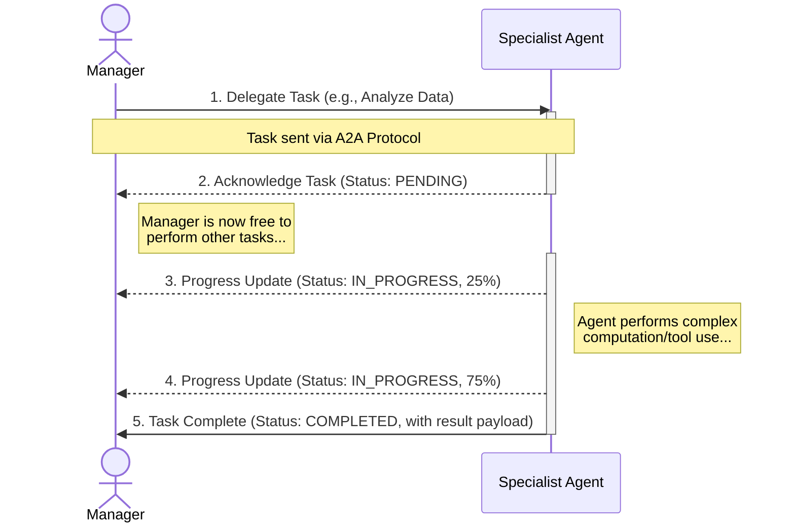
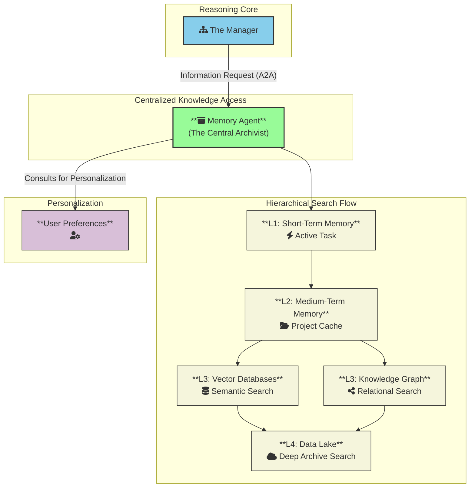
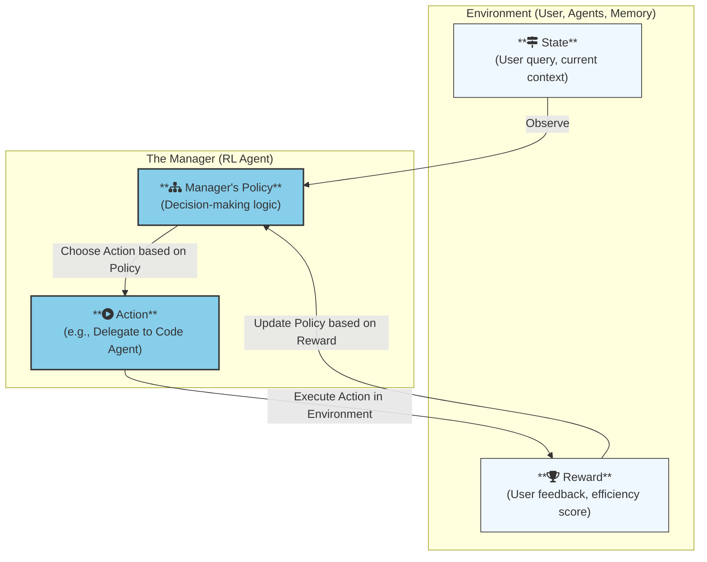
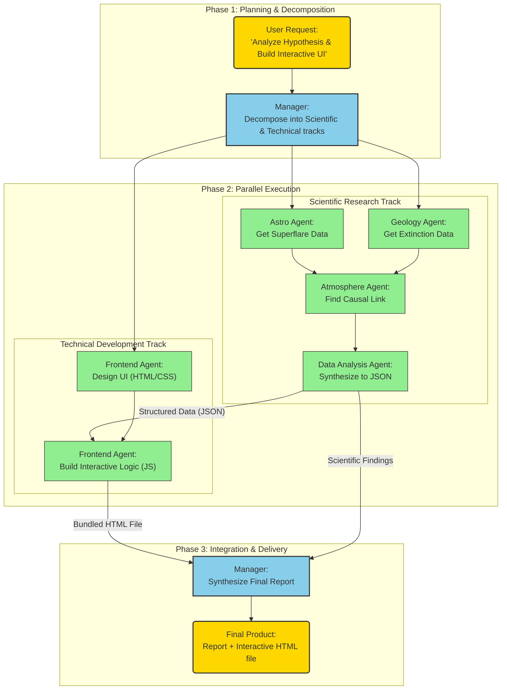

# Organizational Artificial Consciousness (OAC): A Framework for Scalable and Generalizable AI

---

### **Table of Contents**

1.  [Chapter 1: Introduction - Beyond Monolithic Models](#chapter-1-introduction---beyond-monolithic-models)
2.  [Chapter 2: The Hierarchical Organizational Structure](#chapter-2-the-hierarchical-organizational-structure)
3.  [Chapter 3: The Memory Ecosystem](#chapter-3-the-memory-ecosystem)
4.  [Chapter 4: The Evolutionary Engine - Learning Through Experience](#chapter-4-the-evolutionary-engine---learning-through-experience)
5.  [Chapter 5: Conceptual Case Study - Building an Interactive Analysis of a Scientific Hypothesis](#chapter-5-conceptual-case-study---building-an-interactive-analysis-of-a-scientific-hypothesis)
6.  [Chapter 6: Conclusion - The Path Towards a More Integrated AI](#chapter-6-conclusion---the-path-towards-a-more-integrated-ai)

---

### **Chapter 1: Introduction - Beyond Monolithic Models**

**1.1 The Dawn and Era of AI Giants: The Limits of the Current Paradigm**

The last decade has witnessed an unprecedented revolution in the field of Artificial Intelligence, driven primarily by Large Language Models (LLMs) with a monolithic architecture. From the GPT series to Llama and Gemini, the principle of "Scaling Laws" has proven astonishingly effective: as the model size and data volume increase, new and surprising capabilities emerge. These models have acted as single, giant "minds," trained on vast portions of the internet, demonstrating remarkable prowess in understanding and generating language.

However, as these models reach astronomical sizes, cracks have begun to appear in the foundation of this colossal structure. These are not minor issues solvable by further scaling but are systemic limitations inherent to the monolithic architecture itself:

*   **The Scaling Dilemma:** The cost of training these models has become prohibitive computationally, materially, and energetically. We are approaching a point where building the next-largest model is economically and environmentally unsustainable.
*   **The Black Box Problem:** With trillions of parameters, understanding "how" a model reaches its conclusions has become nearly impossible. This lack of interpretability is a major obstacle to trust and safety, especially in sensitive domains like medicine and law.
*   **Contextual Amnesia:** These models suffer from a limited "context window." In long conversations or when dealing with complex projects, they begin to forget initial details, leading to inconsistency and performance degradation.
*   **The Hallucination Epidemic:** When a model does not know the answer, it rarely admits it. Instead, it tends to "invent" facts with complete confidence. This is the natural consequence of a system optimized to be a "next-word prediction machine" rather than a "truth-verification engine."
*   **Static Worldview:** A model is a snapshot of data at its moment of training. It does not learn continuously from its interactions or from new information in the world. Any real update requires a costly retraining process.

These limitations, taken together, suggest that we may be reaching a point of "diminishing returns" for the brute-force scaling approach.

**1.2 The Call for a Paradigm Shift: From "Knowledge" to "Cognitive Organization"**

The solution does not necessarily lie in building a bigger brain, but in designing a smarter organization. Instead of attempting to cram all human knowledge into a single neural network, we propose a shift in the intellectual paradigm: from a focus on **Knowledge Storage** to a focus on **building a Reasoning Process**.

Let's imagine the difference:
*   **The Current Paradigm:** A single genius who has memorized every book in a massive library. Their memory is impressive, but they forget, conflate facts, and have no clear methodology for verifying their information when in doubt.
*   **The Proposed Paradigm:** The CEO of a research organization. They have not memorized every book, but they understand a problem deeply, know exactly which experts on their team to consult (the physicist, the historian, the programmer), and know how to synthesize their reports into a final, coherent, and reliable answer.

**1.3 The Core Philosophy: Decoupling the Mind from the Library**

Before delving into the specifics of the OAC framework, it is essential to establish the philosophical principle that is the cornerstone of this entire work. Our design is based on a **complete and total separation of the "reasoning engine" from the "knowledge base."** We are not trying to build a better model for *storing* information; we are trying to build a better model for the *process of thinking* itself.

Our proposed world consists of two distinct entities:

1.  **The Reasoning Mind:**
    *   This is the core of our system—the Manager and its Agents. These models are **small and purpose-built to master cognitive processes**. Their job is not to "know" that the capital of France is Paris. Their job is to understand the question "What is the capital of France?", form a plan to answer it ("I need a basic geographical fact"), delegate the search task ("Memory Agent, query for the capital of France"), and deliver the result. These models are trained on skills like decomposition, planning, logic, and synthesis—not on memorizing facts.

2.  **The Infinite Library:**
    *   This is the entire Memory Ecosystem. It is a **vast, passive repository of knowledge**. It holds terabytes of data but possesses no intelligence of its own. It can be updated, expanded, corrected, and even completely replaced without retraining the "Reasoning Mind." It is the source of truth to which the "Mind" turns to verify information.

Everything that follows in this manuscript—the hierarchical structure, the specialized agents, the A2A protocol, and the evolutionary engine—is not the goal in itself. Rather, it is the **sophisticated infrastructure we have designed to enable this small, intelligent "Mind" to effectively explore and exploit this massive "Library."** This separation is the first and most fundamental principle of the OAC framework.

This shift is a transition from a **model-centric** paradigm to a **system-centric** or **organizational** one. We are not building a "thing" that knows; we are building a "system" that learns how to discover.

**1.4 Introducing the OAC Framework: Organizational Artificial Consciousness**

To address these challenges, we introduce in this manuscript a new theoretical framework we call **"Organizational Artificial Consciousness" (OAC)**. This framework is not a single model but an integrated architecture built upon three foundational pillars:

1.  **The Hierarchical Organizational Structure:** A command system consisting of a strategic "Manager" and specialized expert "Agents."
2.  **The Memory Ecosystem:** A multi-layered memory architecture that separates working memory, project memory, and the long-term knowledge archive.
3.  **The Evolutionary Engine:** A continuous learning mechanism based on reinforcement learning, allowing the entire system to evolve and improve through experience and feedback.

In the following chapters, we will deconstruct each of these pillars in detail, illustrating how this architecture can lead to an AI that is not only more powerful and capable but also more efficient, interpretable, safe, and adaptable.

---

### **Chapter 2: The Hierarchical Organizational Structure**

To achieve the effective decoupling of the mind and the library, we need a well-defined organizational structure. If the prevailing monolithic model resembles an isolated brain, the OAC framework resembles a living, interactive organization. The foundation of this entity is its clear hierarchical structure, designed for maximum efficiency, specialization, and logical coherence. This structure is not an arbitrary arrangement but a deliberate design that separates strategic thinking from specialized execution. It consists of three distinct layers: the Manager, the Agents, and the Tools, all connected by a central nervous system represented by a standardized communication protocol.

**2.1 The "Manager": The Strategic Mastermind**

At the top of the pyramid sits the "Manager." This entity is not a simple request router but the mastermind of the entire system, embodying the functions of the human prefrontal cortex: planning, decision-making, and coordinating complex processes.

**Characteristics and Functions of the Manager:**
*   **Single Point of Contact:** The Manager is the sole interface with which the user interacts. This ensures a consistent experience and shields the user from the complexities of the system's internal operations.
*   **Problem Decomposition:** The Manager's primary task is never to answer complex questions directly. Instead, it decomposes them into a series of smaller, more manageable "Tasks," based on a deep understanding of the problem's structure and the capabilities available within the "organization."
*   **Strategic Planning and Delegation:** After decomposing the problem, the Manager creates an action plan. This plan is a sequence of tasks to be delegated to the specialist agents in the correct order, leveraging the ability to launch parallel and asynchronous tasks.
*   **Master Context Holder:** The Manager is the only entity that maintains the complete picture of the project or conversation, connecting the various tasks to understand how each contributes to the final goal.
*   **Synthesis and Integration:** When the agents return the results of their tasks through a series of events, it is the Manager's job to assemble these disparate pieces into a final, coherent, and logical answer to be presented to the user.

**2.2 The "Agents": The Specialist Experts**

Below the Manager lies the layer of "Agents." These are not miniature versions of the Manager but true experts, each an independent model trained and optimized to perform a narrow, specific set of tasks with superhuman efficiency.

**Proposed Architecture for Agents: Mixture-of-Experts State-Space Models (MoE-SSM):**
To achieve maximum efficiency, we propose that these agents be built using a hybrid architecture combining Mixture-of-Experts (MoE) and State-Space Models (SSMs). This combination gives them the ability to process sequential information (like code or text) with unparalleled speed and efficiency, while maintaining deep specialization without a massive increase in operational cost.

**Characteristics and Functions of the Agents:**
*   **Deep Specialization:** We have an agent for programming, another for physics, another for financial analysis, and another for memory management. Each agent understands the terminology, tools, and methodologies of its domain far better than any generalist model.
*   **Task-Oriented Awareness:** Agents do not need to know the full context of the project. They receive a specific "context packet" from the Manager containing only what they need to accomplish their current task. This maintains their focus and prevents distraction.
*   **Tool Usage:** Agents are intelligent enough to know not only "what" to do but "how" to do it. They are the ones who decide which tool from the bottom layer is most appropriate for their task.

**2.3 The "Tools": The Reliable Execution Layer**

At the base of the pyramid are the "Tools." These are not intelligent entities but simple, reliable, and narrow-scope programs that perform only one specific function when called.
*   **Examples:** A calculator, a web search API, a code interpreter, a database query interface.
*   **The Benefit:** Separating "reasoning" (at the agent level) from "computation" (at the tool level) ensures reliability. We do not want the model to "hallucinate" the result of a calculation. We want it to call the reliable "calculator tool" to get a 100% accurate result. The agent decides "why" and "when" to add 2+2, but the tool performs the arithmetic itself.

**2.4 Adopting the A2A Protocol for Internal Communication**

For this hierarchical structure to function smoothly, communication cannot be based on ambiguous natural language. Instead, entities must communicate via a strict, structured, and machine-readable **Internal Communication Protocol (ICP)**. This protocol is the organization's machine language, designed for precision, clarity, and traceability.



We propose the adoption of the **A2A (Agent-to-Agent) Protocol** as the central nervous system of the OAC system. A2A provides an ideal framework that perfectly embodies the principles we seek:
*   **Task-Centric Operations:** The protocol revolves around the concept of a "Task" which has a clear lifecycle (from creation to completion or failure), perfectly matching our model of task delegation from the Manager to the Agents.
*   **Structured Contracts via Schemas:** A2A enforces the use of schemas to define the inputs and outputs of each task. This ensures that communication between the Manager and Agents is unambiguous and follows a strict contract.
*   **Asynchronous, Event-Driven Communication:** The most powerful feature of A2A is its support for asynchronicity. The Manager can launch a long-running task (e.g., analyzing a large dataset) and receive continuous `PROGRESS` events without blocking its ability to plan and delegate other tasks in parallel.
*   **Extensibility and Interoperability:** As an open and extensible protocol, A2A allows the OAC system to grow in an organized fashion and potentially interact with other agent-based systems that adhere to the same standards.

**2.5 Architectural Note: Hierarchical System vs. Integrated Mixture-of-Experts**

It is important to distinguish the hierarchical structure proposed in the OAC framework from the integrated "Mixture-of-Experts" (MoE) architecture common in modern models. In an integrated MoE architecture, the "experts" are merely specialized parts within a single, giant neural network. In OAC, we propose a **System of Systems**. The "Manager" and the "Agents" are independent and separate models that communicate via the A2A protocol. This explicit separation is what grants our system its modularity, interpretability, and capacity for deep specialization, thereby mimicking the structure of a real organization rather than just a single, multitasking brain.

---

### **Chapter 3: The Memory Ecosystem**

Having designed the "Reasoning Mind" in the previous chapter, we will now design the "Library" with which it will interact. An organization, no matter how efficient its structure, is useless without an effective institutional memory. Current language models face a systemic "memory crisis"; they suffer from contextual amnesia in long conversations and lack a true mechanism for continuous learning. The solution proposed by the OAC framework is not a desperate attempt to infinitely expand the "context window," but the design of a **multi-layered memory ecosystem**, which closely mimics the flexibility and efficiency of human memory (from sensory, to short-term, to long-term), and is managed by a specialized entity.



**3.1 The "Memory Agent": The Central Archivist**

In line with the principle of separation of concerns, the Manager and specialist agents do not interact directly with databases or file systems. This would distract their focus and create chaos. Instead, all memory operations (storage, retrieval, summarization, updating) are delegated to a single specialist agent: the **"Memory Agent."**

The Memory Agent acts as the "archivist" or "librarian" for the entire organization. It is the sole interface to all layers of memory. When the Manager needs a piece of information, it sends a structured task via the A2A protocol to the Memory Agent, which then decides the most efficient way to find this information within the memory ecosystem. This design ensures centralized knowledge management and makes the entire system more modular and maintainable.

**3.2 The Long-Term Knowledge Ecosystem**

This is the system's permanent knowledge base, and it is not a single database but an integrated, three-tiered system designed to work together:

*   **Tier 1: The Data Lake:** The massive, raw archive (hundreds of terabytes) containing everything in its original form: books, scientific papers, code repositories, images, videos. It is stored on low-cost distributed storage systems. This layer is the last resort, designed for permanent storage, not for immediate retrieval.
*   **Tier 2: The Knowledge Graph:** An intelligent layer built on top of the Data Lake that connects entities (people, places, concepts) and the relationships between them. It doesn't store the full text but rather the "understanding" of relationships. This allows the Manager to ask complex reasoning questions about how concepts are interconnected.
*   **Tier 3: The Vector Database Fleet:** This is the layer for fast semantic search. Here, chunks of data (paragraphs, images) are converted into mathematical representations (vectors). Crucially, this fleet is **partitioned by domain**. The "Physics Agent" primarily searches the "Physics Vector Database," and the "History Agent" searches its own. This partitioning drastically reduces the search scope and increases its accuracy and speed.

**3.3 The Medium-Term Project Cache**

This is the memory that solves the long-context problem in conversations. For each large project or long conversation, the Memory Agent creates a project-specific cache.
*   **Function:** It stores structured summaries, key decisions, intermediate results, and frequently retrieved data from long-term memory.
*   **Benefit:** When the user asks a question related to the same project, the Memory Agent first searches this small, fast cache instead of re-executing expensive searches in the massive ecosystem.

**3.4 The Short-Term Working Memory**

This is the organization's "RAM." It is a fast but volatile memory, dedicated to the currently active task. When the Manager delegates a task to an agent, the "context packet" and necessary information are loaded into that agent's working memory. Once the task is complete and the result is returned, this memory is cleared to make way for the next task. This ensures that each agent is focused only on what is important right now.

**3.5 The User Preferences Memory**

This is the layer that gives OAC a personal touch, elevating it from a mere tool to a partner. It is a persistent database linked to each user, continuously updated by the Memory Agent. This memory stores user preferences inferred from their interactions: their preferred coding style, the level of detail they want in answers, topics they are interested in, and even their preferred communication style. At the start of each conversation, the Manager consults this memory to tailor its behavior to the user.

**3.6 Information Flow Through the Memory Layers**

When the Manager requests information via the Memory Agent, an efficient hierarchical search process begins:
1.  **Search Working Memory (L1 Cache):** Is the information related to the currently active task?
2.  **Search Project Cache (L2 Cache):** If not in L1, has it been accessed previously in this project's context?
3.  **Search Vector Databases (Hot Storage):** If not in L2, a semantic search is launched in the relevant specialist database.
4.  **Search Knowledge Graph:** If the question requires reasoning about relationships, this layer is consulted.
5.  **Search Data Lake (Cold Storage):** As a last resort, if all else fails, a search and analysis job can be launched on the raw archive.

This hierarchical system ensures that 99% of requests are served with extreme speed from the upper layers, making the handling of terabytes of data both feasible and efficient.

---

### **Chapter 4: The Evolutionary Engine - Learning Through Experience**

A system that does not learn from its successes and failures is a system doomed to stagnation. The true power of the OAC framework lies not only in its organizational structure or its multi-layered memory but in its integrated **evolutionary engine**. This engine, based primarily on the principles of Reinforcement Learning and reflective mechanisms, is the mechanism that allows the system to self-improve, develop a strategic "intuition," and uniquely personalize its interactions for each user. It transforms the system from a smart executor of rules into a genuine learner.



**4.1 The Manager as a Reinforcement Learning Agent: Mastering the Art of Management**

The "Manager" is not a static planner but a reinforcement learning agent at its core. Every problem presented by the user is a new "episode" in its continuous training process.

*   **State:** A comprehensive description of the current situation: the user's request, the contents of working and project memory, and the status of available agents.
*   **Actions:** The set of decisions available to the Manager, such as "delegate task to the programming agent," "request summary from the memory agent," "ask user a clarifying question," or "submit the final answer."
*   **Reward Function:** This is the heart of the learning process. The reward is not simply "right" or "wrong" but a complex, multifaceted signal designed to encourage effective and intelligent behavior:
    *   **Final Success Reward (+100):** A large reward when the user confirms that the provided solution is correct and effective.
    *   **Progress Reward (+5):** A small reward for each successful step from an agent that returns useful information, bringing the system closer to the solution.
    *   **Inefficiency Penalty (-1):** A small penalty for every unnecessary step or thought cycle, teaching the Manager to find the most direct path to the solution.
    *   **Annoyance Penalty (-10):** A larger penalty for asking the user a question whose answer could have been found internally, teaching it self-reliance.
    *   **Failure Penalty (-100):** A massive penalty for providing a clearly wrong or hallucinatory answer that is corrected by the user.

Through this process, the Manager develops an optimal "policy." It begins to learn which action plans are most effective for certain types of problems and which agents are best suited for any given task.

**4.2 Balancing Exploration and Exploitation: Managing Uncertainty**

One of the most critical skills the Manager must learn is to manage "uncertainty," also known as the "exploration-exploitation trade-off." The critical, ongoing decision is: **when to exploit current knowledge and provide a deductive answer, and when to explore for more information to reduce doubt?**

*   **Evaluation Mechanism:** The decision is based on a quantitative assessment of uncertainty, measured by:
    1.  **Confidence Scores:** Returned by agents with their results. A low confidence score is a strong signal to "explore" further.
    2.  **Cross-Source Contradiction:** If information from two different agents contradicts, the system's uncertainty level rises sharply, forcing the Manager to launch additional verification tasks.
*   **Rewarding Prudence:** The reward function is adjusted to penalize "recklessness" (providing an answer based on low-confidence information that proves to be wrong) and reward "prudence" (requesting more data when uncertainty was high, which led to correcting the solution's path), teaching the Manager to be a cognitive risk assessor.

**4.3 Agent Improvement via Internal Feedback**

Each agent receives implicit "performance reviews" from the Manager, allowing it to refine its specialty. If the "Search Agent" returns 10 documents and the Manager only uses the first two, this is a powerful feedback signal. This signal can be used to fine-tune the "Search Agent's" model to become better at ranking results by relevance next time, mimicking the manager-employee feedback loop in a real workplace.

**4.4 Hyper-Personalization via Reinforcement Learning from Human Feedback (RLHF)**

The "User Preferences Memory" is dynamically activated via a continuous version of RLHF. Explicit signals (likes/dislikes) and implicit signals (accepting answers without modification) from the user are used to fine-tune the Manager's policy, causing it to favor decisions that align with the user's style and preferences.

**4.5 The "Metacognition Agent": The Independent Reflective Engine**

To achieve a quantum leap in learning, we embody the process of self-reflection in a powerful, independent **"Metacognition Agent."**

*   **Role:** This agent does not participate in day-to-day problem-solving. Its function is to **monitor the performance of the entire organization and strategically improve its processes.**
*   **Mechanism:**
    1.  After a complex task is completed, its full transaction log is automatically sent to this agent.
    2.  The agent analyzes the log offline, searching for inefficiencies, recurring patterns, and missed opportunities.
    3.  This agent produces **"Improvement Recommendations"** that are sent to the relevant parties: recommendations for the Manager to update its policy, for the Memory Agent to distill new knowledge, or even for human engineers to alert them to structural problems.

By separating this function, we mimic a real company's "Quality Assurance & Strategic Development" department. This frees up the "Manager" to focus on immediate problems, while the "Metacognition Agent" works on making the entire organization smarter in the future.

---

### **Chapter 5: Conceptual Case Study - Building an Interactive Analysis of a Scientific Hypothesis**

To demonstrate the full potential of the OAC framework, we will apply it to a problem that transcends the capabilities of any monolithic language model. The problem is a composite task that requires scientific investigation, data synthesis, and the development of an interactive user interface to present the results.

#### **Case Study Flowchart: Multi-track Task Execution**



**The Problem Posed by a User (an Astrobiologist):**
> "I am investigating a new hypothesis. Could there be a correlation between extreme solar activity cycles (Superflares) and minor extinction events on Earth over the last 500 million years? I need a preliminary assessment of this hypothesis, **and please present the findings in an interactive web page (HTML/CSS/JS) with a timeline that allows a user to explore the data themselves.**"

**Step 1: Strategic Decomposition by the "Manager"**

The "Manager" receives the request and immediately recognizes it consists of two parallel but interdependent tracks: a **scientific research track** and a **technical development track**.

*   **Manager's Thought Process:** "I have two goals: first, to conduct the scientific analysis. Second, to build a web interface to display the results. The research track must begin first, as its outputs will be the inputs for the development track. I will launch the scientific investigation immediately, and once the required data schema is clear, I will launch the development track in parallel to save time."

*   **Initial Action Plan:**
    1.  **Scientific Track:**
        *   (A) Gather data on ancient solar activity.
        *   (B) Gather data on minor extinction events.
        *   (C) Search for a potential causal mechanism.
        *   (D) Synthesize all scientific findings into a structured data format (JSON).
    2.  **Technical Track:**
        *   (E) Design and structure the web page (HTML/CSS).
        *   (F) Program the interactive logic (JavaScript) to display the data.
        *   (G) Bundle everything into a final, deliverable file.

**Step 2: Executing the Scientific Research Track**

The Manager launches a series of asynchronous and independent tasks via the A2A protocol.
*   **Task (A) to the "Astrophysics Agent":** "Gather data and estimates on the frequency of solar superflares over the last 500 million years."
*   **Task (B) to the "Geology Agent":** "Identify and date the most prominent minor extinction events during the same period."

After evaluating the initial responses, the Manager identifies the need for a causal mechanism.
*   **Task (C) to the "Atmospheric Physics Agent":** "Model the potential impact of a solar superflare on Earth's ozone layer."

**Step 3: Synthesizing the Scientific Data**

Once tasks (A, B, C) are complete, the Manager launches the next task.
*   **Task (D) to the "Data Analysis Agent":**
    ```json
    {
      "target_agent_id": "data_analysis_agent",
      "task_objective": "Synthesize all scientific findings into a structured JSON file for a timeline visualization.",
      "context_packet": { "data_sources": [ "astro_physics_report", "geology_report", "atmospheric_report" ] },
      "required_output_format": { "schema": "pre-defined_timeline_schema.json" }
    }
    ```
The agent organizes all information into a JSON file containing a list of events, each with a date, type (extinction/flare), description, and confidence score.

**Step 4: Executing the Technical Development Track in Parallel**

With a structured data file now available, the Manager can confidently launch the development track.
*   **Task (E) to the "Frontend Development Agent":**
    ```json
    {
      "target_agent_id": "frontend_dev_agent",
      "task_objective": "Design and code the HTML structure and CSS styling for an interactive timeline.",
      "context_packet": { "design_brief": "Clean, academic look. A main timeline container, and a details box for displaying event information." }
    }
    ```
The agent writes the HTML and CSS, and may use a "Tool" like an "Icon Library" to fetch appropriate visual icons.

**Step 5: Integrating Interactive Logic and Finalizing the Product**

Finally, the Manager launches the final task to connect the data to the interface.
*   **Task (F) & (G) to the "Frontend Development Agent":**
    ```json
    {
      "target_agent_id": "frontend_dev_agent",
      "task_objective": "Write JavaScript to dynamically populate the timeline from the provided JSON and make it interactive. Bundle everything into a single file.",
      "context_packet": {
        "html_code": "[...]",
        "css_code": "[...]",
        "data_json": "[...]"
      },
      "required_output_format": { "type": "single_html_file_with_embedded_css_js" }
    }
    ```
The agent writes the necessary JavaScript and uses a "Bundler" tool to package everything into a single, self-contained HTML file.

**Step 6: Final Delivery to the User**

The Manager delivers the final product in two parts:
1.  **The Written Scientific Summary:** A balanced assessment of the hypothesis, noting its theoretical viability (due to the ozone depletion mechanism) but the weakness of current correlational evidence (due to imprecise solar flare data), and recommending a path for future research.
2.  **The Interactive File (timeline.html):** A standalone web page that the user can open to explore the data themselves, providing full transparency and allowing them to draw their own conclusions.

**Enhanced Conclusion:**
In this scenario, the OAC system not only conducted a multidisciplinary scientific investigation but also managed a small software development project in parallel. It coordinated experts in physics, geology, data analysis, and frontend development, using a diverse set of tools. This demonstrates how the OAC framework can scale to handle composite tasks that blend abstract reasoning with creative and technical execution, which lies at the heart of much of human knowledge work.

---

### **Chapter 6: Conclusion - The Path Towards a More Integrated AI**

We began this manuscript with a simple premise: that the future evolution of AI lies not just in building larger models, but in designing smarter architectures. Throughout the preceding chapters, we have designed a theoretical framework, "Organizational Artificial Consciousness" (OAC), not as a replacement for Large Language Models, but as their natural evolution—placing them within a hierarchical, organizational context that mimics the efficiency and resilience of human organizations.

**6.1 Synthesizing the Vision: A System Beyond the Sum of its Parts**

The OAC framework is not merely a collection of technologies but an integrated design philosophy. We have seen how:
*   **The Hierarchical Organizational Structure**, led by a strategic "Manager" and a fleet of specialist "Agents," allows for the decomposition of complex problems into manageable tasks, achieving a depth of specialization not possible in monolithic models.
*   **The Multi-Layered Memory Ecosystem**, managed by a central "Memory Agent," solves the long-context dilemma and provides a robust mechanism for knowledge management, separating fast working memory from the permanent knowledge archive.
*   **The Evolutionary Engine**, powered by reinforcement learning and overseen by a "Metacognition Agent," breathes life into this structure, allowing the system to learn from experience, reduce errors, and adapt to user preferences, becoming smarter with every interaction.

When these systems work in concert, they create a synergistic effect. The result is a system that doesn't just "know," but "understands" how to discover, evaluate, synthesize, and present knowledge in innovative ways, as demonstrated in our case study.

**6.2 OAC as a Step Towards Safer and More Interpretable AGI**

The pursuit of Artificial General Intelligence (AGI) often raises legitimate concerns about safety and control. The OAC framework, by its very nature, offers inherent advantages that address some of these concerns:

*   **Interpretability:** Instead of an opaque "black box," OAC provides a transparent "chain of command." Thanks to the structured internal communication protocol (A2A), every decision and task can be traced from the Manager to the Agent to the Tool. This makes the "thought" process auditable, allowing us to understand "why" the system made a particular decision.
*   **Fine-Grained Control:** The modular architecture allows for precise control. If a particular "agent" exhibits undesirable behavior, it can be isolated, replaced, or retrained without affecting the entire system.
*   **Reduced Hallucination:** By decoupling reasoning from computation (via Tools) and knowledge from the reasoning engine (via the separate Memory), the system reduces its reliance on "guessing" and increases its reliance on retrieving and verifying facts.

**6.3 Future Challenges and Open Questions**

While the OAC framework presents a promising vision, turning it into a reality poses formidable challenges and exciting research questions:

*   **The Manager's Training Challenge:** How can we collect large-scale "procedural" data to train the "Manager" on strategic planning and decomposition skills? Can this data be synthetically generated?
*   **The Overhead Challenge:** Will the cost of communication and coordination between agents outweigh their benefits for simpler tasks? How does the system decide when to use the full organizational structure versus relying on a single agent?
*   **The Concurrent Evolution Challenge:** How do we ensure that different agents evolve together harmoniously? How do we manage their dependencies when one is updated?
*   **The Philosophical Question of Consciousness:** Could such a system, with its capacity for self-monitoring and reflection via the "Metacognition Agent," develop a primitive form of "functional self-awareness"?

**6.4 Conclusion: Towards a New Era of Artificial Intelligence**

The era of the "lone giants" in AI was a necessary and fruitful stage, but it may be drawing to a close. The future lies not in building a single mythical creature, but in learning how to build intelligent "societies" of specialized agents that work together in harmony.

The "Organizational Artificial Consciousness" framework is our contribution to sketching the outlines of this future. It is an invitation to researchers and engineers to think beyond merely scaling up parameters and to begin designing the architecture, organization, and processes that may one day lead to a form of artificial intelligence that is more integrated, safer, and more aligned with the complexity of human thought itself.