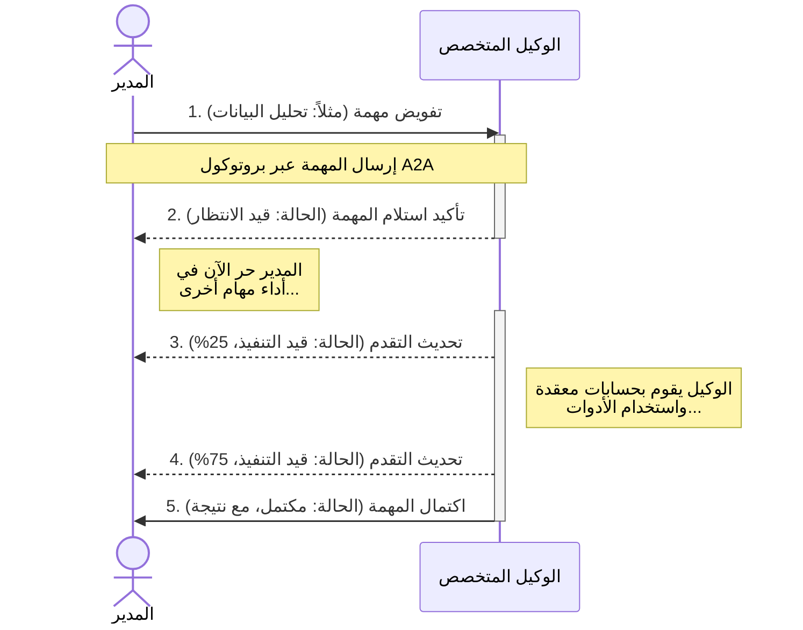
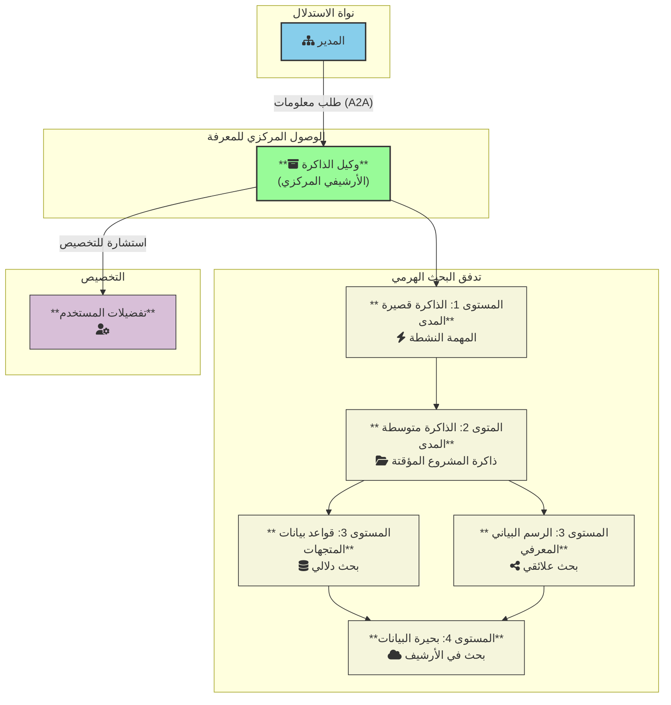
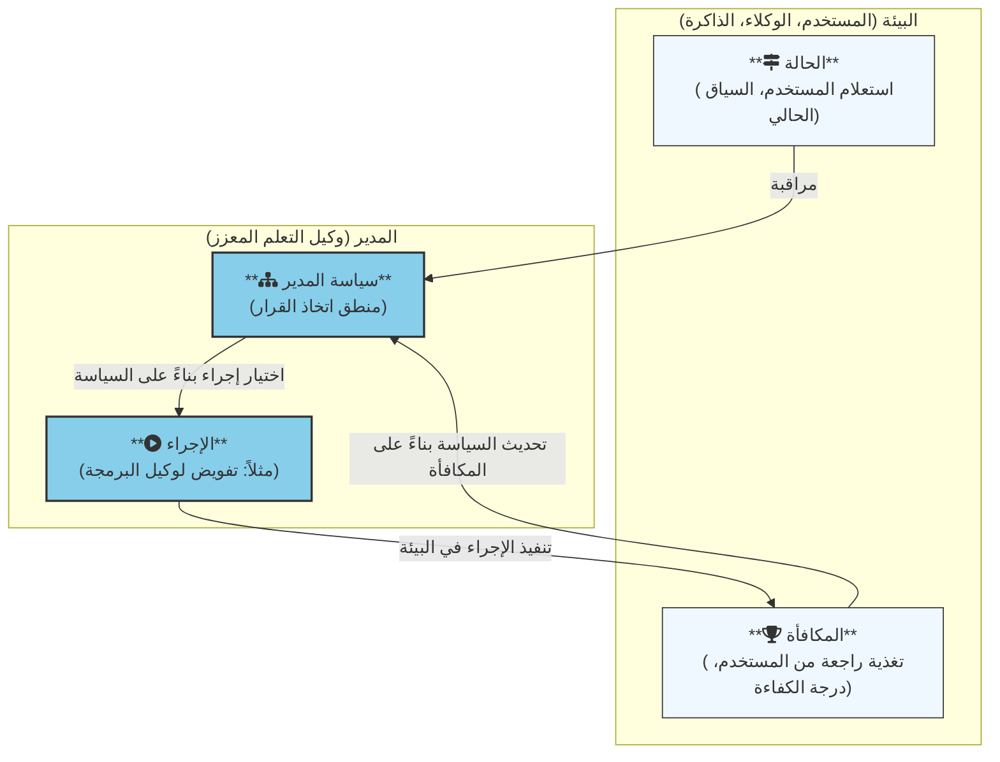

# الوعي الاصطناعي التنظيمي (OAC): إطار عمل قابل للتوسع والتفسير للوكلاء عامي الغرض

## 1. الملخص (Abstract)

تواجه النماذج اللغوية الكبيرة (LLMs) الحالية، على الرغم من نجاحها، قيودًا جوهرية في قابلية التوسع، والقابلية للتفسير، والتعلم المستمر، ويرجع ذلك إلى حد كبير إلى أنها تخلط بين الاستدلال والمعرفة. نقدم في هذه الورقة "الوعي الاصطناعي التنظيمي" (OAC)، وهو إطار عمل مبتكر لتصميم أنظمة ذكاء اصطناعي عامة الغرض يعالج هذه التحديات من خلال تحول فلسفي جوهري: الفصل الصريح لمحرك الاستدلال عن قاعدة المعرفة. إن بنية OAC هي نظام هرمي من الأنظمة (system-of-systems)، يتميز بوجود "مدير" استراتيجي ينسق أسطولًا من "الوكلاء" الخبراء المتخصصين. هؤلاء الوكلاء، الذين يتميزون بصغر حجمهم وكفاءتهم وتصميمهم لغرض محدد، يتفاعلون مع نظام بيئي للذاكرة خارجي ومتعدد الطبقات عبر بروتوكول اتصال معياري وغير متزامن (A2A). يشتمل الإطار على آلية تعلم معزز متعددة الأوجه، مما يمكّن النظام من التعلم من التجربة، وإدارة عدم اليقين، وتحسين سياساته التشغيلية بمرور الوقت من خلال التفكير الانعكاسي. من خلال تصميم الذكاء كـ "مجتمع" منظم ومعياري من الوكلاء بدلاً من كيان واحد كلي المعرفة، يقدم OAC مسارًا نحو أنظمة ذكاء اصطناعي أكثر قابلية للتوسع والتفسير والأمان والقدرة على التكيف.

---

## 2. المقدمة (Introduction)

لقد كان ظهور النماذج اللغوية الكبيرة مدفوعًا بقوانين التوسع، مما أظهر أن زيادة حجم النموذج وبياناته تؤدي إلى قدرات ناشئة ملحوظة. ومع ذلك، يواجه هذا النموذج المتجانس تحديات متزايدة: تكاليف تدريب غير مستدامة، وغموض متأصل (مشكلة "الصندوق الأسود")، وفقدان للذاكرة السياقية، وميل للهلوسة، ورؤية ثابتة للعالم مجمدة في وقت التدريب. تشير هذه القيود إلى أننا نقترب من نقطة العائد المتناقص لنهج القوة الغاشمة.

تجادل هذه الورقة بأن التحول النموذجي التالي يتطلب الانتقال من التركيز على **تخزين المعرفة** إلى إتقان **عملية الاستدلال**. نقترح مبدأً معماريًا أساسيًا: **فصل العقل المفكر عن مكتبة المعرفة**. فبدلاً من نموذج واحد "يعرف"، نقوم بتصميم نظام "يفكر". يتكون هذا النظام من محرك استدلال مدمج وفعال (الوكلاء) مهارته الأساسية هي فهم المشاكل، وصياغة الخطط، واستعلام قاعدة معرفة خارجية سلبية وقابلة للتحقق (الذاكرة).

لهذه الغاية، نقدم إطار الوعي الاصطناعي التنظيمي (OAC). OAC هو مخطط لنظام هرمي متعدد الوكلاء مصمم لقابلية التوسع والتفسير والتعلم المستمر. في هذه الورقة، نفصل المكونات الأساسية لإطار OAC، ونقدم دراسة حالة نظرية لإظهار قدراته، ونناقش آثاره على أمان الذكاء الاصطناعي والأبحاث المستقبلية.

---

## 3. إطار عمل OAC (The OAC Framework)

يتكون OAC من ثلاثة أعمدة أساسية: بنية هرمية، ونظام بيئي للذاكرة متعدد الطبقات، ومحرك تعلم تطوري، جميعها مترابطة عبر بروتوكول اتصال معياري.

### 3.1 البنية المعمارية الهرمية
OAC هو **نظام من الأنظمة** مع فصل واضح للمهام:
*   **المدير:** وكيل استراتيجي عالي المستوى مسؤول عن تفكيك المشاكل، والتخطيط، وتفويض المهام. وهو الواجهة الوحيدة للمستخدم.
*   **الوكلاء:** أسطول من النماذج المستقلة والمتخصصة (مثل وكيل الفيزياء، وكيل البرمجة، وكيل الذاكرة)، كل منها محسن لمجال محدد. نقترح بنائها على معماريات فعالة مثل نماذج فضاء الحالة (SSMs).
*   **الأدوات:** طبقة من الوظائف البسيطة والموثوقة وغير الذكية (مثل الآلة الحاسبة، ومترجم الأكواد، واستدعاءات API) التي ينفذها الوكلاء.

### 3.2 بروتوكول الاتصال
لضمان التنسيق الموثوق والقابل للتتبع، تلتزم جميع الاتصالات الداخلية بـ **بروتوكول A2A (Agent-to-Agent)**. يوفر هذا:
*   **هيكل قائم على المهام:** كل تفويض هو "مهمة" رسمية لها دورة حياة واضحة.
*   **عقود منظمة عبر المخططات (Schemas):** يتم تحديد المدخلات والمخرجات بشكل صارم، مما يلغي الغموض.
*   **تدفق غير متزامن قائم على الأحداث:** يتيح تنفيذ المهام بالتوازي والعمليات غير الحاجبة، وهو أمر حاسم للكفاءة.

### 3.3 النظام البيئي للذاكرة
"مكتبة المعرفة" هي نظام متطور متعدد الطبقات يديره حصريًا **وكيل ذاكرة** مخصص. هذا يفصل المعرفة عن وكلاء الاستدلال ويوفر مصدرًا واحدًا للحقيقة.

تشمل الطبقات:
*   **التخزين طويل الأمد:** بحيرة بيانات (بيانات خام)، ورسم بياني معرفي (للعلاقات)، وأسطول من قواعد بيانات المتجهات المقسمة حسب المجال (للبحث الدلالي السريع).
*   **ذاكرة التخزين المؤقت متوسطة المدى:** ذاكرة مؤقتة خاصة بالمشروع لتخزين الملخصات والبيانات المتكررة، مما يخفف من مشاكل السياق الطويل.
*   **الذاكرة قصيرة المدى:** ذاكرة عاملة متطايرة ومخصصة للمهمة النشطة للوكلاء.
*   **ذاكرة تفضيلات المستخدم:** ملف تعريف مستمر لكل مستخدم لتمكين التخصيص الفائق.

### 3.4 آليات التعلم والتطور
تم تصميم OAC ليتحسن بمرور الوقت من خلال عملية تعلم مستمرة:

*   **سياسة المدير:** المدير هو وكيل تعلم معزز (RL) يتعلم استراتيجيات التخطيط والتفويض المثلى. تعتمد دالة المكافأة الخاصة به على نجاح المهمة النهائي، والكفاءة، وردود فعل المستخدم.
*   **وكيل ما وراء المعرفة:** وكيل مخصص يحلل سجلات المهام المكتملة بشكل غير متزامن. يحدد أوجه القصور ويقدم "توصيات تحسين" إلى المدير وأجزاء أخرى من النظام، مما يتيح التفكير الانعكاسي عالي المستوى والتحسين الاستراتيجي.

---

## 4. دراسة حالة نظرية
لتوضيح قدرات OAC، ننظر في مهمة مركبة: "حلل الارتباط بين العواصف الشمسية العملاقة وأحداث الانقراض الصغرى على مدى الـ 500 مليون سنة الماضية وقدم النتائج في صفحة ويب تفاعلية."

من المرجح أن يفشل نموذج متجانس بسبب طبيعة المهمة متعددة التخصصات والوسائط. في المقابل، سيقوم مدير OAC بتفكيكها إلى مسارين رئيسيين: البحث العلمي والتطوير التقني.
1.  سيفوض مهامًا متوازية إلى **وكيل الفيزياء الفلكية** و**وكيل الجيولوجيا** لجمع البيانات.
2.  سيكلف **وكيل الفيزياء الجوية** بالعثور على آلية سببية.
3.  سيقوم **وكيل تحليل البيانات** بعد ذلك بتوليف هذه النتائج في تنسيق JSON منظم.
4.  بالتوازي، سيتم تكليف **وكيل تطوير الواجهات الأمامية** بإنشاء هيكل HTML/CSS، باستخدام أدوات مثل مكتبة أيقونات.
5.  أخيرًا، سيتلقى وكيل الواجهات الأمامية بيانات JSON ويستخدم JavaScript لإنشاء التصور التفاعلي، ويدمج كل شيء في ملف واحد للمستخدم.

توضح دراسة الحالة هذه قدرة OAC على تنسيق خبراء متخصصين متنوعين لحل مشكلة معقدة تتطلب كلاً من الاستدلال المجرد والتنفيذ الإبداعي.

---

## 5. المناقشة

### 5.1 الآثار المترتبة على الأمان والقابلية للتفسير
تقدم بنية OAC مزايا كبيرة للسلامة:
*   **القابلية للتفسير:** توفر سجلات بروتوكول A2A "سلسلة قيادة" كاملة وقابلة للتدقيق لكل قرار، مما يجعل استدلال النظام شفافًا.
*   **التحكم الدقيق:** تتيح الطبيعة المعيارية التحكم الدقيق. يمكن عزل وكيل معيب أو تصحيحه أو استبداله دون زعزعة استقرار النظام بأكمله.
*   **تقليل الهلوسة:** من خلال فصل الاستدلال عن المعرفة والحساب، يتم تحفيز النظام على استعلام مصادر بيانات يمكن التحقق منها واستخدام أدوات موثوقة، بدلاً من اختلاق الإجابات.

### 5.2 القيود والعمل المستقبلي
تمثل التحديات الرئيسية في تحقيق OAC طرقًا بحثية في حد ذاتها:
*   **بيانات التدريب:** يتطلب المدير كميات هائلة من "البيانات الإجرائية" (مثل سجلات إدارة المشاريع)، وهي ليست متاحة بسهولة مثل النصوص الخام.
*   **التكلفة العامة للاتصال:** يجب إدارة تكلفة الأداء للاتصال بين الوكلاء بعناية لضمان عدم تجاوزها للفوائد في المهام البسيطة.
*   **التطور المتزامن:** يعد تطوير طرق لإدارة الاعتماديات وضمان التطور المتناغم مع تحديث وكلاء متعددين بشكل مستقل تحديًا هندسيًا معقدًا.

---

## 6. الخاتمة
لقد قدمنا إطار الوعي الاصطناعي التنظيمي (OAC)، وهو نموذج تصميمي جديد للذكاء الاصطناعي يرتكز على المبدأ الأساسي المتمثل في فصل الاستدلال عن المعرفة. من خلال هيكلة الذكاء كمجتمع هرمي من الوكلاء المتخصصين والمتصلين، يقدم OAC مسارًا نحو أنظمة ذكاء اصطناعي أكثر قابلية للتوسع والتفسير والقدرة على التكيف من النماذج المتجانسة الحالية. نعتقد أن هذا النهج الذي يركز على النظام يمثل خطوة حاسمة في الرحلة نحو ذكاء عام اصطناعي أكثر أمانًا وقدرة.

---

## 7. المراجع

1.  A2A Protocol Authors. (2024). "Agent-to-Agent Communication Protocol Specification". Retrieved from a2a-protocol.org.

2.  Fedus, W., Zoph, B., & Shazeer, N. (2022). "Switch transformers: Scaling to trillion parameter models with simple and efficient sparsity". *Journal of Machine Learning Research*, 23(120), 1-39.

3.  Gu, A., & Dao, T. (2023). "Mamba: Linear-Time Sequence Modeling with Selective State Spaces". *arXiv preprint arXiv:2312.00752*.

4.  Lewis, P., Perez, E., Piktus, A., Petroni, F., Karpukhin, V., Nogueira, G., ... & Kiela, D. (2020). "Retrieval-augmented generation for knowledge-intensive NLP tasks". *Advances in Neural Information Processing Systems*, 33, 9459-9474.

5.  Ouyang, L., Wu, J., Jiang, X., Almeida, D., Wainwright, C. L., Mishkin, P., ... & Lowe, R. (2022). "Training language models to follow instructions with human feedback". *Advances in Neural Information Processing Systems*, 35, 27730-27744.

6.  Vaswani, A., Shazeer, N., Parmar, N., Uszkoreit, J., Jones, L., Gomez, A. N., ... & Polosukhin, I. (2017). "Attention is all you need". *Advances in neural information processing systems*, 30.

7.  Wei, J., Wang, X., Schuurmans, D., Bosma, M., Chi, E., Le, Q., & Zhou, D. (2022). "Chain-of-thought prompting elicits reasoning in large language models". *Advances in Neural Information Processing Systems*, 35, 24824-24837.

8.  Yao, S., Zhao, J., Yu, D., Du, N., Shafran, I., Narasimhan, K., & Cao, Y. (2023). "ReAct: Synergizing reasoning and acting in language models". *International Conference on Learning Representations*.