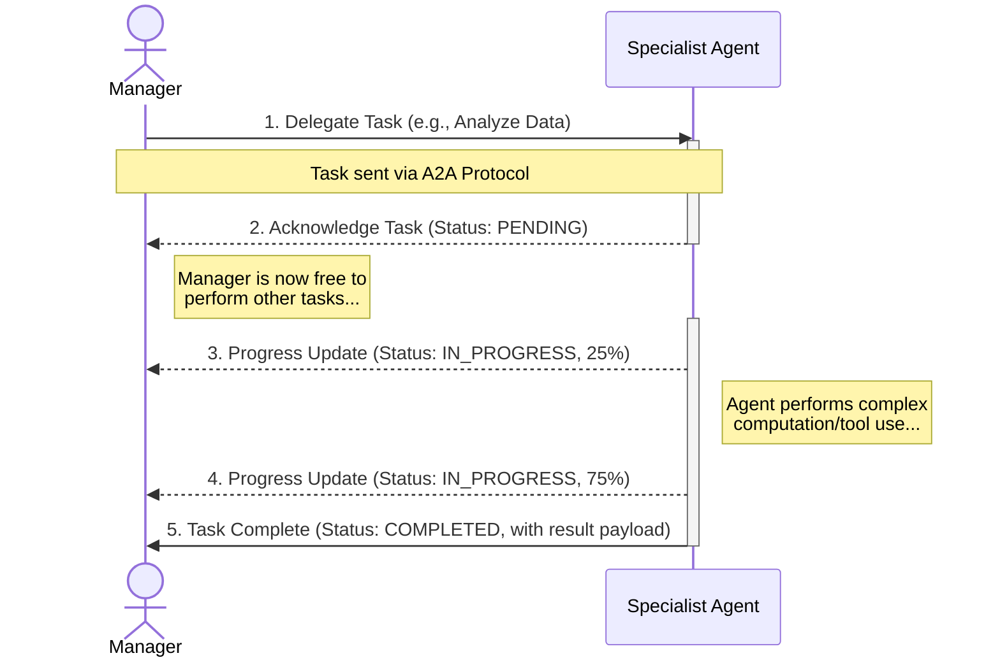
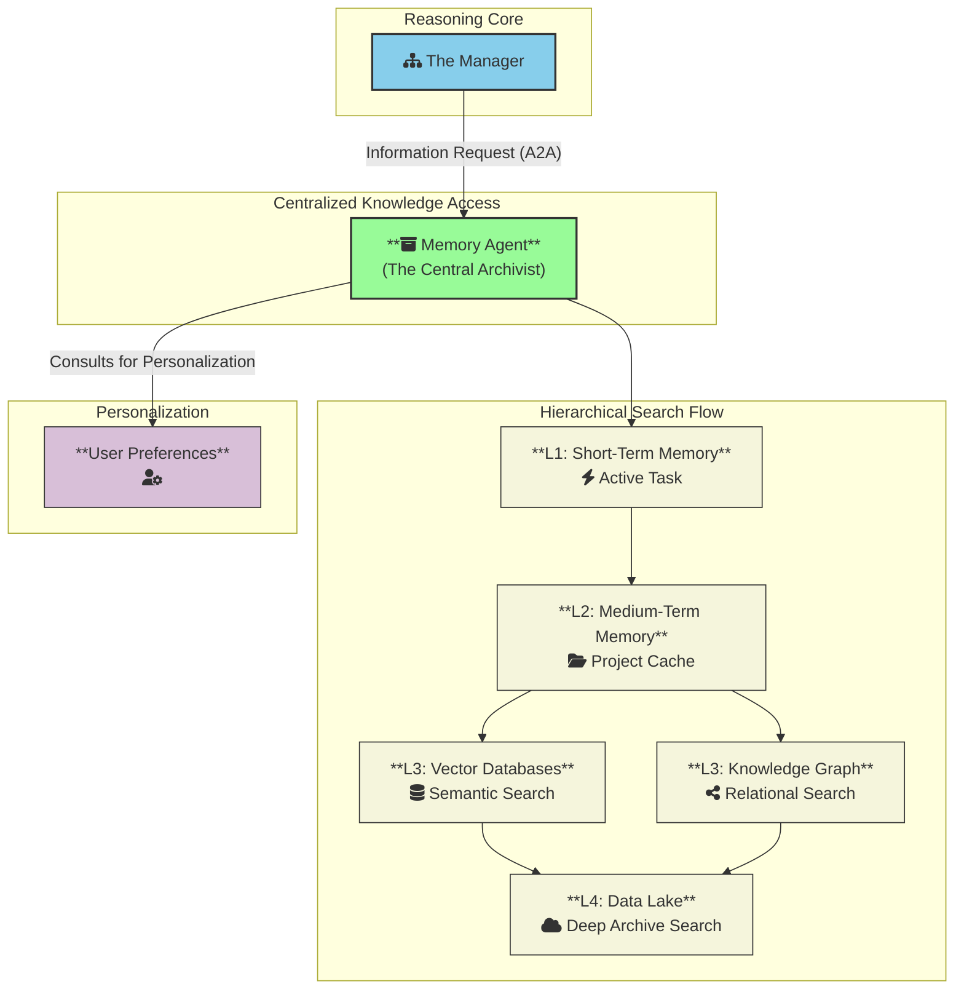
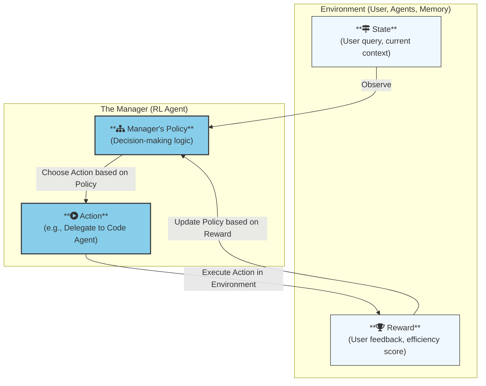

# Organizational Artificial Consciousness (OAC): A Scalable and Interpretable Framework for General-Purpose Agents

## 1. Abstract

Current monolithic Large Language Models (LLMs), despite their success, face fundamental limitations in scalability, interpretability, and continuous learning, largely because they conflate reasoning and knowledge. We introduce Organizational Artificial Consciousness (OAC), a novel framework for designing general-purpose AI systems that addresses these challenges through a core philosophical shift: the explicit decoupling of the reasoning engine from the knowledge base. The OAC architecture is a hierarchical system-of-systems, featuring a strategic "Manager" agent that coordinates a fleet of specialized "Executor" agents. These agents, which are small, efficient, and purpose-built, interact with a vast, external, and multi-layered Memory Ecosystem via a standardized, asynchronous communication protocol (A2A). The framework incorporates a multi-faceted reinforcement learning mechanism, enabling the system to learn from experience, manage uncertainty, and improve its operational policies over time through self-reflection. By architecting intelligence as a modular and organized society of agents rather than a single, all-knowing entity, OAC presents a path toward AI systems that are more scalable, interpretable, safe, and adaptable.

---

## 2. Introduction

The advent of Large Language Models (LLMs) has been driven by scaling laws, demonstrating that increasing model size and data volume yields remarkable emergent capabilities. However, this monolithic paradigm faces growing challenges: unsustainable training costs, inherent opacity (the "black box" problem), contextual amnesia due to limited context windows, a propensity for hallucination, and a static worldview frozen at the time of training. These limitations suggest we are approaching the point of diminishing returns for the brute-force scaling approach.

This paper argues that the next paradigm shift requires moving from a focus on **knowledge storage** to perfecting the **reasoning process**. We propose a fundamental architectural principle: the **decoupling of the reasoning mind from the knowledge library**. Instead of a single model that *knows*, we design a system that *thinks*. This system consists of a compact, efficient reasoning engine (the agents) whose primary skill is to understand problems, formulate plans, and query an external, passive, and verifiable knowledge base (the memory).

To this end, we introduce the Organizational Artificial Consciousness (OAC) framework. OAC is a blueprint for a hierarchical, multi-agent system designed for scalability, interpretability, and continuous learning. In this paper, we detail the core components of the OAC framework, present a conceptual case study to demonstrate its capabilities, and discuss its implications for AI safety and future research.

---

## 3. The OAC Framework

OAC is composed of three foundational pillars: a hierarchical architecture, a multi-layered memory ecosystem, and an evolutionary learning engine, all interconnected via a standardized communication protocol.

### 3.1 Hierarchical Architecture

OAC is a **System of Systems** with a clear separation of concerns:
*   **The Manager:** A high-level strategic agent responsible for problem decomposition, planning, and task delegation. It is the sole interface for the user.
*   **The Agents:** A fleet of independent, specialized models (e.g., Physics Agent, Code Agent, Memory Agent), each optimized for a specific domain. We propose they be built on efficient architectures like State-Space Models (SSMs).
*   **The Tools:** A layer of simple, reliable, non-intelligent functions (e.g., calculator, code interpreter, API caller) that are executed by the agents.

### 3.2 Communication Protocol

To ensure reliable and traceable coordination, all internal communication adheres to the **A2A (Agent-to-Agent) Protocol**. This provides:
*   **Task-Centric Structure:** Every delegation is a formal "Task" with a clear lifecycle.
*   **Schema-Enforced Contracts:** Inputs and outputs are strictly defined, eliminating ambiguity.
*   **Asynchronous & Event-Driven Flow:** Enabling parallel task execution and non-blocking operations, which is crucial for efficiency.

### 3.3 Memory Ecosystem

The "knowledge library" is a sophisticated, multi-layered system managed exclusively by a dedicated **Memory Agent**. This decouples knowledge from the reasoning agents and provides a single source of truth. The layers include:
*   **Long-Term Storage:** A Data Lake (raw data), a Knowledge Graph (for relationships), and a fleet of domain-specific Vector Databases (for fast semantic search).
*   **Medium-Term Cache:** A project-specific cache to store summaries and frequently accessed data, mitigating long-context issues.
*   **Short-Term Memory:** Volatile, task-specific working memory for active agents.
*   **User Preferences Memory:** A persistent profile for each user to enable hyper-personalization.

### 3.4 Learning and Evolution

OAC is designed to improve over time through a continuous learning process:
*   **The Manager's Policy:** The Manager is an RL agent that learns optimal planning and delegation strategies. Its reward function is based on final task success, efficiency, and user feedback.
*   **The Metacognition Agent:** A dedicated agent that analyzes completed task logs offline. It identifies inefficiencies and provides "Improvement Recommendations" to the Manager and other parts of the system, enabling high-level self-reflection and strategic optimization.

---

## 4. Conceptual Case Study

To illustrate OAC's capabilities, we consider a composite task: "Analyze the correlation between solar superflares and minor extinction events over the last 500 million years and present the findings in an interactive web page."

A monolithic model would likely fail due to the task's multi-domain and multi-modal nature. In contrast, the OAC Manager would decompose this into two main tracks: scientific research and technical development.
1.  It would delegate parallel tasks to the **Astrophysics Agent** and **Geology Agent** to gather data.
2.  It would task an **Atmospheric Physics Agent** to find a causal mechanism.
3.  A **Data Analysis Agent** would then synthesize these findings into a structured JSON format.
4.  In parallel, a **Frontend Development Agent** would be tasked with creating the HTML/CSS structure, using Tools like an icon library.
5.  Finally, the Frontend Agent would receive the JSON data and use JavaScript to create the interactive visualization, bundling everything into a single file for the user.

This case study demonstrates OAC's ability to coordinate diverse, specialized experts to solve a complex problem that requires both abstract reasoning and creative execution.

---

## 5. Discussion

### 5.1 Implications for AI Safety and Interpretability
The OAC architecture offers significant advantages for safety:
*   **Interpretability:** The A2A protocol logs provide a complete, auditable "chain of command" for every decision, making the system's reasoning transparent.
*   **Control:** The modular nature allows for fine-grained control. A malfunctioning agent can be isolated, debugged, or replaced without destabilizing the entire system.
*   **Reduced Hallucination:** By separating reasoning from knowledge and computation, the system is incentivized to query verifiable data sources and use reliable tools, rather than inventing answers.

### 5.2 Limitations and Future Work
The primary challenges in realizing OAC are research avenues in themselves:
*   **Training Data:** The Manager requires vast amounts of "procedural data" (e.g., project management logs, problem-solving transcripts) for training, which is not as readily available as raw text.
*   **Communication Overhead:** The performance cost of inter-agent communication must be carefully managed to ensure it doesn't negate the benefits for simpler tasks.
*   **Concurrent Evolution:** Developing methods to manage dependencies and ensure coherent evolution as multiple agents are updated independently is a complex engineering challenge.

---

## 6. Conclusion

We have introduced the Organizational Artificial Consciousness (OAC) framework, a new paradigm for AI design centered on the fundamental principle of decoupling reasoning from knowledge. By structuring intelligence as a hierarchical society of specialized, communicating agents, OAC offers a path toward AI systems that are more scalable, interpretable, and adaptable than current monolithic models. We believe this system-centric approach represents a crucial step in the journey toward safer and more capable **Artificia l** General Intelligence.

---

## 7. References

1.  A2A Protocol Authors. (2024). "Agent-to-Agent Communication Protocol Specification". Retrieved from a2a-protocol.org.

2.  Fedus, W., Zoph, B., & Shazeer, N. (2022). "Switch transformers: Scaling to trillion parameter models with simple and efficient sparsity". *Journal of Machine Learning Research*, 23(120), 1-39.

3.  Gu, A., & Dao, T. (2023). "Mamba: Linear-Time Sequence Modeling with Selective State Spaces". *arXiv preprint arXiv:2312.00752*.

4.  Lewis, P., Perez, E., Piktus, A., Petroni, F., Karpukhin, V., Nogueira, G., ... & Kiela, D. (2020). "Retrieval-augmented generation for knowledge-intensive NLP tasks". *Advances in Neural Information Processing Systems*, 33, 9459-9474.

5.  Ouyang, L., Wu, J., Jiang, X., Almeida, D., Wainwright, C. L., Mishkin, P., ... & Lowe, R. (2022). "Training language models to follow instructions with human feedback". *Advances in Neural Information Processing Systems*, 35, 27730-27744.

6.  Vaswani, A., Shazeer, N., Parmar, N., Uszkoreit, J., Jones, L., Gomez, A. N., ... & Polosukhin, I. (2017). "Attention is all you need". *Advances in neural information processing systems*, 30.

7.  Wei, J., Wang, X., Schuurmans, D., Bosma, M., Chi, E., Le, Q., & Zhou, D. (2022). "Chain-of-thought prompting elicits reasoning in large language models". *Advances in Neural Information Processing Systems*, 35, 24824-24837.

8.  Yao, S., Zhao, J., Yu, D., Du, N., Shafran, I., Narasimhan, K., & Cao, Y. (2023). "ReAct: Synergizing reasoning and acting in language models". *International Conference on Learning Representations*.