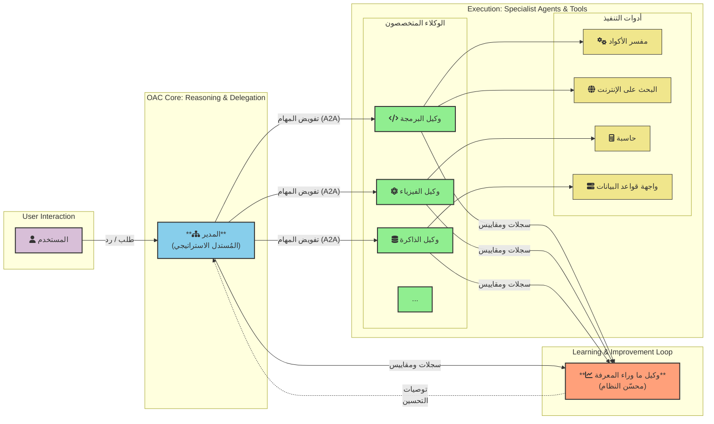

# OAC: الوعي الاصطناعي التنظيمي (OAC)

  

**[English Version](./README.md)**

---

OAC هو إطار عمل نظري ومخطط مستقبلي لتصميم أنظمة الذكاء الاصطناعي من الجيل القادم. إنه يتجاوز النماذج المتجانسة عبر اقتراح بنية هرمية متعددة الوكلاء، حيث يتم تنسيق "وكلاء" ذكاء اصطناعي متخصصين وصغار الحجم بواسطة "مدير" مركزي لحل المشاكل المعقدة.

تقوم الفلسفة الجوهرية لـ OAC على **الفصل التام بين محرك الاستدلال وقاعدة المعرفة**. فبدلاً من بناء نماذج ضخمة "تعرف" كل شيء، نهدف إلى بناء نماذج "استدلال" أصغر وأكثر كفاءة، تتقن مهارات التفكير، والتخطيط، والتعلم، وتصل إلى مكتبة معرفة خارجية ضخمة وقابلة للتحديث.

هذا المستودع هو المحور المركزي لإطار OAC.

---

## 📚 مستندات المشروع

يحتوي هذا المستودع على وثيقتين أساسيتين: مخطوطة مفصلة للتعمق في الفكرة، وورقة بحثية موجزة للملخص الأكاديمي.

### 1. المخطوطة الكاملة
*وثيقة شاملة ومفصلة تشرح البنية الكاملة، والفلسفة، ومستقبل إطار OAC.*

- 📖 **قراءة المخطوطة (العربية)**: [`MANUSCRIPT-AR.md`](./MANUSCRIPT-AR.md)
- 📖 **Read the Manuscript (English)**: [`MANUSCRIPT-EN.md`](./MANUSCRIPT-EN.md)

### 2. الورقة البحثية
*ورقة بحثية أكاديمية رسمية وموجزة تلخص إطار OAC، وآثاره، والعمل المستقبلي.*

- 📄 **قراءة الورقة البحثية (العربية)**: [`PAPER-AR.md`](./PAPER-AR.md)
- 📄 **Read the Paper (English)**: [`PAPER-EN.md`](./PAPER-EN.md)

---

### المبادئ الأساسية

- **الهيكل الهرمي:** "مدير" استراتيجي يفوض المهام إلى "وكلاء" خبراء متخصصين.
- **الذاكرة المنفصلة:** نظام بيئي للذاكرة، خارجي ومتعدد الطبقات، يعمل كمصدر وحيد للحقيقة.
- **الاتصال المعياري:** يتواصل الوكلاء عبر بروتوكول رسمي مثل [A2A (Agent-to-Agent Protocol)](https://a2a-protocol.org/latest/).
- **التطور المستمر:** يتعلم النظام ويتحسن بمرور الوقت من خلال التعلم المعزز والتفكير الانعكاسي.