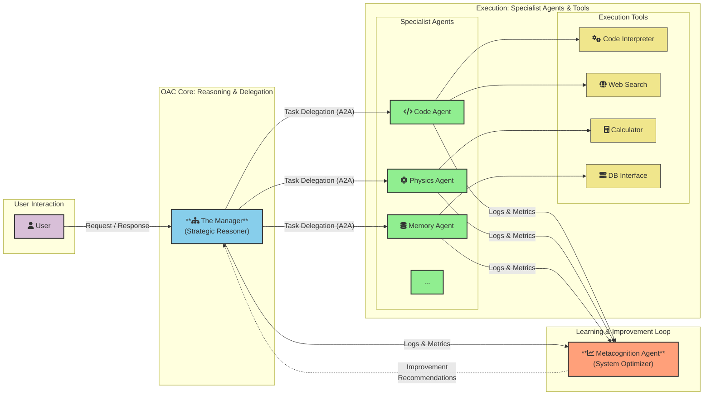

# OAC: Organizational Artificial Consciousness

  

**[Available in Arabic](./README-AR.md) | متوفر باللغة العربية**

---

OAC is a theoretical framework and a future-looking blueprint for designing next-generation AI systems. It moves beyond monolithic models by proposing a hierarchical, multi-agent architecture where small, specialized AI "agents" are coordinated by a central "manager" to solve complex problems.

The core philosophy of OAC is the complete **separation of the reasoning engine from the knowledge base**. Instead of building massive models that "know" everything, we aim to build smaller, more efficient "reasoning" models that are masters of thinking, planning, and learning, and that access a vast, external, and updatable knowledge library.

This repository is the central hub for the OAC framework.

---

## 📚 Project Documents

This repository hosts two primary documents: a detailed manuscript for a deep dive, and a concise research paper for an academic overview.

### 1. The Full Manuscript
*A comprehensive, book-length document detailing the complete architecture, philosophy, and future of the OAC framework.*

- 📖 **Read the Manuscript (English)**: [`MANUSCRIPT-EN.md`](./MANUSCRIPT-EN.md)
- 📖 **قراءة المخطوطة (العربية)**: [`MANUSCRIPT-AR.md`](./MANUSCRIPT-AR.md)

### 2. The Research Paper
*A formal, condensed academic paper summarizing the OAC framework, its implications, and future work.*

- 📄 **Read the Paper (English)**: [`PAPER-EN.md`](./PAPER-EN.md)
- 📄 **قراءة الورقة البحثية (العربية)**: [`PAPER-AR.md`](./PAPER-AR.md) 

---

## Core Principles

- **Hierarchical Structure:** A "manager" agent delegates tasks to specialized "executor" agents.
- **Decoupled Memory:** An external, multi-layered memory ecosystem serves as the single source of truth.
- **Standardized Communication:** Agents communicate via a formal protocol like [A2A (Agent-to-Agent Protocol)](https://a2a-protocol.org/latest/).
- **Continuous Evolution:** The system learns and improves over time through reinforcement learning and self-reflection.